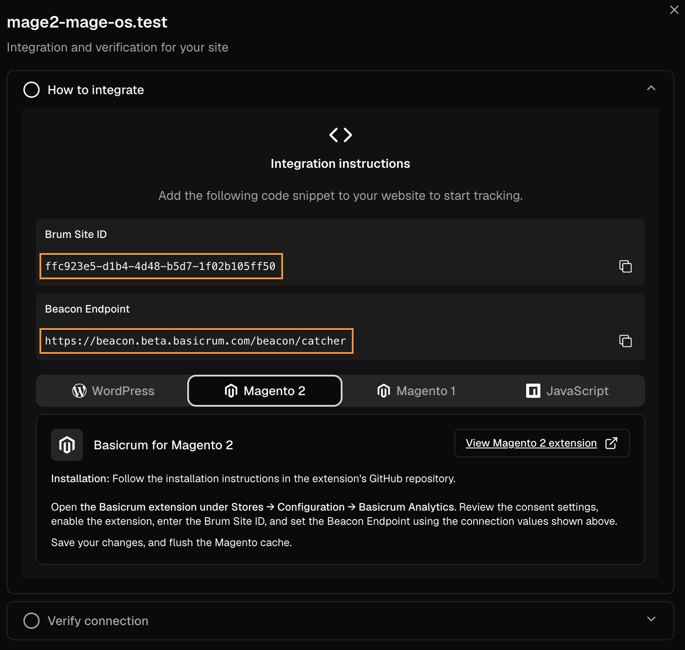
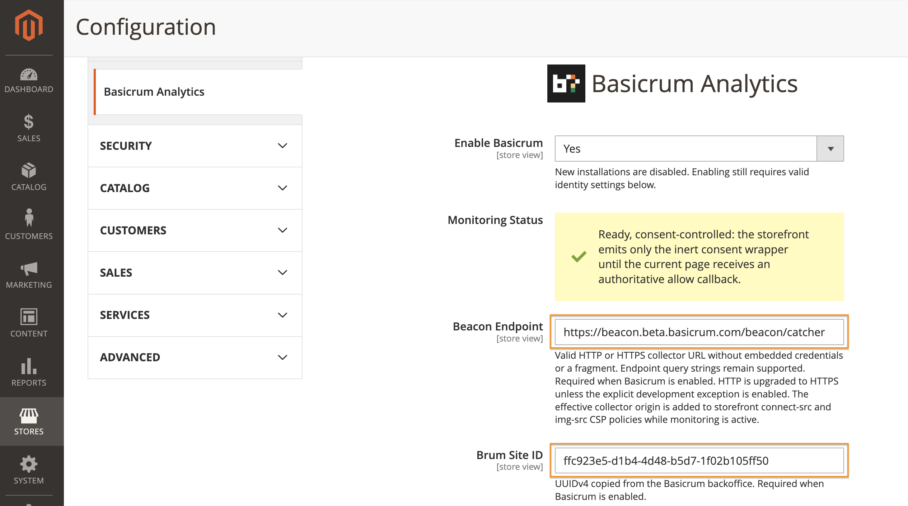
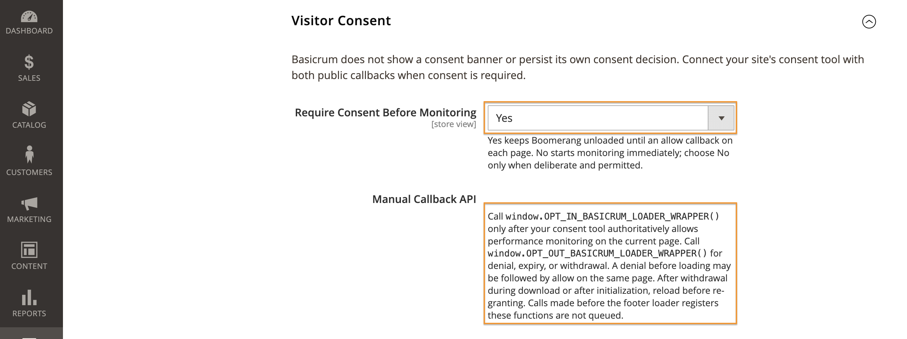
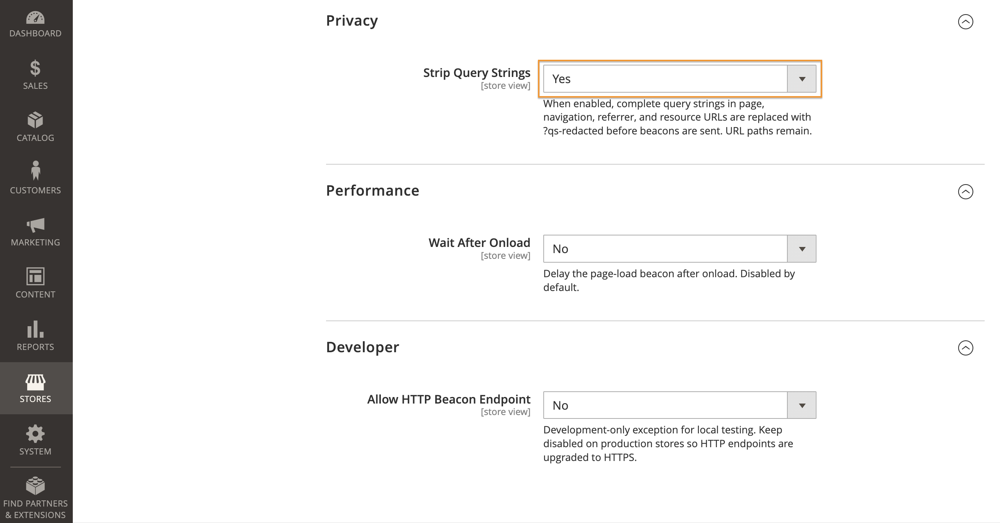

# Basicrum Analytics

Basicrum adds Boomerang real user monitoring (RUM) to a Magento 2 storefront.
Collect performance data through your Basicrum Beacon Endpoint, with
consent-controlled loading and configurable privacy settings.

## Installation

Run commands from your Magento installation directory as the filesystem owner.
Back up your application and database, and test on staging first. For production,
use your normal deployment process; enable maintenance mode for an in-place
installation and disable it only after successful deployment and verification.

Install Basicrum Analytics from the
[`basicrum/basicrum-magento-2`](https://packagist.org/packages/basicrum/basicrum-magento-2)
Composer package:

```sh
composer require 'basicrum/basicrum-magento-2:^0.1'
```

The version constraint selects the `0.1.x` release line.

Alternatively, for a manual source installation, place this module at the exact
path below. The casing is required on case-sensitive filesystems:

```text
app/code/Basicrum/Analytics
```

Use either Composer or a manual installation, never both. After either method,
enable and initialize the module:

```sh
bin/magento module:enable Basicrum_Analytics
bin/magento setup:upgrade
bin/magento setup:di:compile
```

In production mode, deploy static content for all storefront and Admin locales.
For an English-only installation:

```sh
bin/magento setup:static-content:deploy en_US
```

Replace or extend `en_US` with your actual locales. Then clean caches and verify
that the module is enabled:

```sh
bin/magento cache:clean
bin/magento module:status Basicrum_Analytics
```

Monitoring remains disabled until you configure and enable Basicrum below.

## Compatibility

Tested with **Magento Open Source 2.4.7-p10**, **PHP 8.3**, Luma, and built-in
full-page cache. Other Magento/PHP combinations, Adobe Commerce, Hyvä,
headless/PWA storefronts, Varnish, and third-party optimizers are not verified.

## Configuration

### Get your collector details

In the [Basicrum portal](https://app.beta.basicrum.com/), open
**Account > Settings > Sites**. Choose **Add Site** or an existing site, then
copy its **Beacon Endpoint** and **Brum Site ID**. Use your own site's values;
the screenshots show an example.



### Enable Basicrum in Magento

Open **Stores > Configuration > Basicrum > Basicrum Analytics**. Settings support
Magento default, website, and store inheritance.

Set **Enable Basicrum** to **Yes**, enter your collector details, and click
**Save Config**. Consent is still required by default.



Required settings:

- **Enable Basicrum**: new installations default to No.
- **Beacon Endpoint**: a valid HTTP or HTTPS collector URL without embedded
  credentials or a fragment. Endpoint query strings are supported. HTTPS is
  enforced unless the explicit development exception is enabled.
- **Brum Site ID**: a UUIDv4 copied from the Basicrum backoffice.

If Basicrum is disabled or required configuration is missing or invalid, no
monitoring scripts are emitted. The Monitoring Status row explains why
monitoring is inactive. Settings are validated on save and at runtime.

### Other collection settings

- **Wait After Onload** defaults to No with a zero delay. Its configured delay
  is bounded to 30,000 milliseconds.
- **Allow HTTP Beacon Endpoint** defaults to No and is intended only for local
  development. Without it, saved and effective HTTP endpoints are upgraded to
  HTTPS. Magento classifies this exception as environment-specific: configuration
  dumps put it in `app/etc/env.php`, not shared `app/etc/config.php`. Do not promote
  development `env.php` values to production. This follows Magento's native
  [configuration deployment rules](https://experienceleague.adobe.com/en/docs/commerce-operations/configuration-guide/deployment/technical-details).

Beacons include the configured `brum_site_id`, `p_gen=mage2`, and a `p_type`
page label such as `Home`, `Product`, `Search`, or `Checkout Success`.
Unmapped actions use `unmapped_<lowercase full action name>`; an unavailable
action uses `unknown`.

## Consent integration

Under **Visitor Consent**, **Require Consent Before Monitoring** defaults to
**Yes**. Boomerang, measurement cookies, and beacons wait for your consent tool
to allow monitoring on each page. Select **No** only for a deliberate
immediate-loading policy.



Basicrum provides manual, page-level callbacks for your consent platform.
It does not display a banner, automatically connect to consent providers,
infer consent from cookies, or persist its own consent decision.

When the site's external consent tool authoritatively allows performance
monitoring on the current page, call:

```js
if (typeof window.OPT_IN_BASICRUM_LOADER_WRAPPER === "function") {
  window.OPT_IN_BASICRUM_LOADER_WRAPPER();
}
```

On denial, expiry, or withdrawal, call:

```js
if (typeof window.OPT_OUT_BASICRUM_LOADER_WRAPPER === "function") {
  window.OPT_OUT_BASICRUM_LOADER_WRAPPER();
}
```

The consent wrapper is inert until allow. Repeated allow calls load Boomerang
at most once. Once initialized, Boomerang uses the first-party `RT` measurement
cookie; Basicrum does not create a consent cookie. Denial before the first allow
does not prevent a later allow on that page. Withdrawal during download prevents
the arriving bundle from initializing. Withdrawal after initialization disables
further collection, cancels a pending Wait After Onload timer, and removes
accessible measurement cookies. Data already transmitted cannot be retracted.

After withdrawal once loading has started, re-grant requires a page reload.
This intentionally prevents a same-page restart from a partially initialized
state. The callbacks are registered by the footer loader; calls made before
registration are not queued. Connect both allow and deny/change events in the
site's consent tool on every page.

## Strip query strings

Under **Privacy**, set **Strip Query Strings** to **Yes** to redact queries
from page, navigation, referrer, and resource URLs. The default is **No**.
For example, `/search?q=boots` becomes `/search?qs-redacted`; URL paths remain.
This does not change query parameters in your configured Beacon Endpoint.



## Caching and CSP

After changing module configuration, clean Magento configuration, layout,
block HTML, and full-page caches. Production deployments must also publish the
new static assets and invalidate any CDN or optimizer cache that can retain old
HTML or JavaScript. Magento's versioned static asset URLs provide browser cache
invalidation only after the deployment/content version changes.

Then visit the storefront, grant consent through your consent tool, and check
the browser's Network panel for a beacon to your endpoint containing your
`brum_site_id`. With consent required, no beacon should appear before opt-in.

The loader and Boomerang are first-party Magento static assets. Inline scripts
use Magento's `SecureHtmlRenderer` for CSP-compatible rendering.

When you configure the **Beacon Endpoint** in Magento Admin and enable Basicrum
with valid settings, the module automatically allows the endpoint's domain in
the storefront `connect-src` and `img-src` CSP directives. No separate manual
CSP whitelist entry is needed for that endpoint. The allowed value is its origin
(scheme, host, and optional port), not the full URL: paths and query strings are
excluded. Disabled or invalid configuration adds no collector origin, and no
wildcard is added. Clean the caches described above after saving settings so
cached storefront responses use the updated policy.

If your store uses script delay, combination, or other optimization extensions,
verify consent handling and script loading on staging before deployment.

## Privacy and lifecycle notes

Boomerang may collect page/navigation/referrer/resource URLs, performance
timings, browser/network characteristics, and the configured Basicrum identity,
then send them to the configured Beacon Endpoint. With consent-controlled
loading, the Boomerang monitoring bundle, beacon transmission, and measurement
cookies do not start before the current page receives allow. The inert consent
wrapper is present so the external tool can signal that decision. Immediate
mode has no such gate.

Disabling the module and cleaning page caches stops future script emission.
Removing module files does not delete stored configuration or data already
sent to a collector.
Store operators remain responsible for their consent tool, privacy disclosure,
collector access, retention, and deletion processes.

## Third-party software and license

Boomerang 1.815.60 provenance, checksums, and license notices are recorded in
[Third-party notices](THIRD-PARTY-NOTICES.txt) and the
[Boomerang license](view/frontend/web/js/boomr/LICENSE.txt).

Basicrum Analytics is licensed under the [MIT License](LICENSE). Bundled
Boomerang remains covered by its BSD license and third-party notices.
